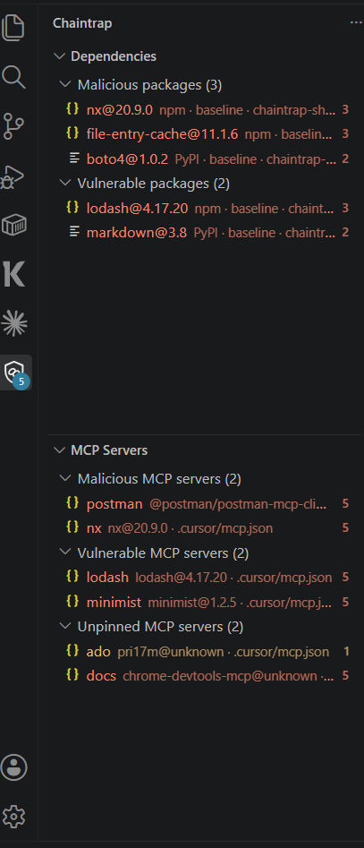
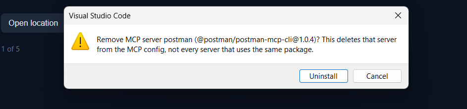
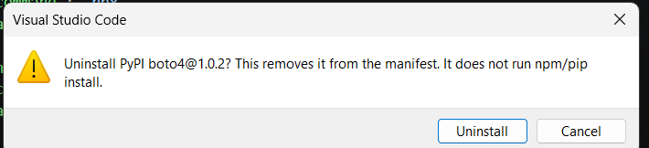

<h1 style="font-family: Palatino, 'Palatino Linotype', 'Book Antiqua', Georgia, serif; font-weight: 700; letter-spacing: -0.03em; margin: 0.4em 0 0.25em;">Chaintrap Agent Shield</h1>

<a href="https://marketplace.visualstudio.com/items?itemName=pri17m.chaintrap-agent-shield"><b>Marketplace</b></a>
&nbsp;·&nbsp;
<a href="https://github.com/pri17m/chaintrap-agent-shield"><b>GitHub</b></a>
&nbsp;·&nbsp;
<a href="PRIVACY.md"><b>Privacy</b></a>

Workspace visibility for packages introduced by AI coding agents (Cursor, Claude Code, GitHub Copilot). Chaintrap inventories npm and PyPI pins in the open folder and in MCP server configs, classifies each as malicious or vulnerable, and shows a workspace posture rollup so the operator can see what needs attention, what coverage is incomplete, and what was checked.

<h2 style="font-family: Palatino, 'Palatino Linotype', 'Book Antiqua', Georgia, serif; font-weight: 700;">Coverage</h2>

<ul style="font-family: 'Trebuchet MS', 'Gill Sans', 'Segoe UI', sans-serif; line-height: 1.55;">
<li><b>Dependencies:</b> workspace manifests and lockfiles. With a lockfile, locked transitives are included.</li>
<li><b>MCP servers:</b> the package inferred from each server entry in workspace <code>.vscode/mcp.json</code> or <code>.cursor/mcp.json</code> (for example <code>npx</code> or <code>pip</code>), plus user-level MCP configs. Listed separately from project dependencies so the operator sees which server pulled the pin.</li>
<li><b>Unpinned MCP servers:</b> config has a package name and no version, so the pin cannot be checked.</li>
</ul>

Findings are malicious (known-bad or malware advisory) or vulnerable (CVE or GHSA). High and critical findings require an acknowledgement in the editor.

Malicious MCP servers are removed from that config by server id. Malicious npm and PyPI pins are removed from <code>package.json</code> or <code>requirements.txt</code>.

<h2 style="font-family: Palatino, 'Palatino Linotype', 'Book Antiqua', Georgia, serif; font-weight: 700;">Operation</h2>

<ol style="font-family: 'Trebuchet MS', 'Gill Sans', 'Segoe UI', sans-serif; line-height: 1.55;">
<li>Install <code>pri17m.chaintrap-agent-shield</code>.</li>
<li>Open a workspace folder. Status bar: <code>Chaintrap: scanning workspace…</code></li>
<li>Open the Chaintrap activity bar: <b>Workspace posture</b> first (attention, coverage gaps, what was checked), then <b>Dependencies</b> or <b>MCP servers</b>.</li>
</ol>

No API key is required for this scan. The extension reads dependency and MCP files in open folders. It does not execute workspace code and does not upload source. See <a href="PRIVACY.md"><b>PRIVACY.md</b></a>.

<h2 style="font-family: Palatino, 'Palatino Linotype', 'Book Antiqua', Georgia, serif; font-weight: 700;">Commands</h2>

<table>
<tr>
<th style="font-family: Palatino, 'Palatino Linotype', Georgia, serif;">Command</th>
<th style="font-family: Palatino, 'Palatino Linotype', Georgia, serif;">Action</th>
</tr>
<tr>
<td style="font-family: 'Trebuchet MS', 'Gill Sans', 'Segoe UI', sans-serif;"><b>Chaintrap: Rescan workspace baseline</b></td>
<td style="font-family: 'Trebuchet MS', 'Gill Sans', 'Segoe UI', sans-serif;">Run the workspace inventory again</td>
</tr>
<tr>
<td style="font-family: 'Trebuchet MS', 'Gill Sans', 'Segoe UI', sans-serif;"><b>Chaintrap: Show workspace posture</b></td>
<td style="font-family: 'Trebuchet MS', 'Gill Sans', 'Segoe UI', sans-serif;">Focus the Workspace posture tree (also bound to the status bar)</td>
</tr>
<tr>
<td style="font-family: 'Trebuchet MS', 'Gill Sans', 'Segoe UI', sans-serif;"><b>Chaintrap: Review agent changes since last session</b></td>
<td style="font-family: 'Trebuchet MS', 'Gill Sans', 'Segoe UI', sans-serif;">List findings that appeared after this window opened</td>
</tr>
<tr>
<td style="font-family: 'Trebuchet MS', 'Gill Sans', 'Segoe UI', sans-serif;"><b>Chaintrap: Acknowledge high/critical finding</b></td>
<td style="font-family: 'Trebuchet MS', 'Gill Sans', 'Segoe UI', sans-serif;">Record that a serious finding was reviewed</td>
</tr>
<tr>
<td style="font-family: 'Trebuchet MS', 'Gill Sans', 'Segoe UI', sans-serif;"><b>Chaintrap: Uninstall malicious package</b></td>
<td style="font-family: 'Trebuchet MS', 'Gill Sans', 'Segoe UI', sans-serif;">Remove a malware pin or that MCP server from the config</td>
</tr>
<tr>
<td style="font-family: 'Trebuchet MS', 'Gill Sans', 'Segoe UI', sans-serif;"><b>Chaintrap: Open finding location</b></td>
<td style="font-family: 'Trebuchet MS', 'Gill Sans', 'Segoe UI', sans-serif;">Open the file that pinned the package</td>
</tr>
</table>

MIT. <a href="https://github.com/pri17m/chaintrap-agent-shield">github.com/pri17m/chaintrap-agent-shield</a>

