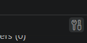
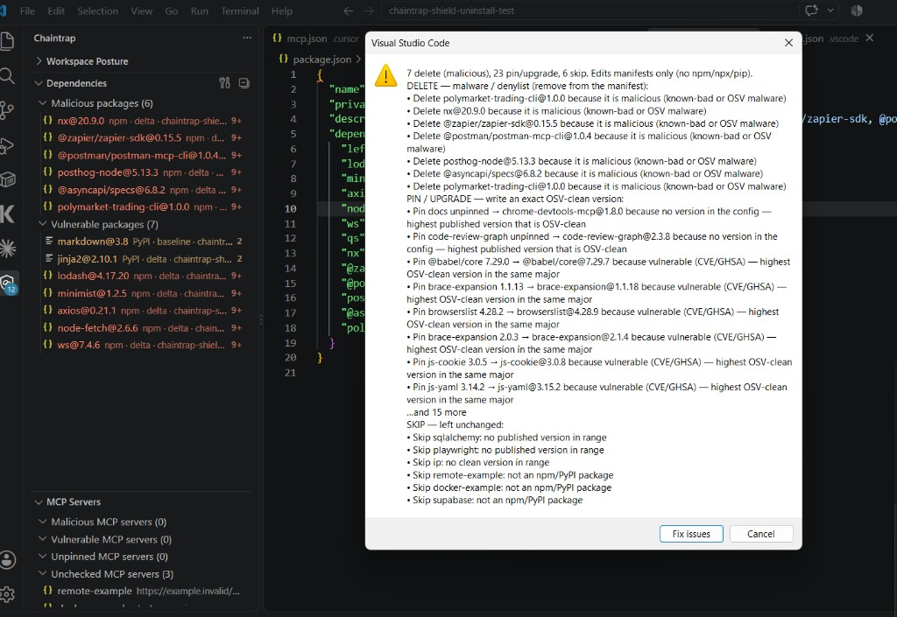

<h1 style="font-family: Palatino, 'Palatino Linotype', 'Book Antiqua', Georgia, serif; font-weight: 700; letter-spacing: -0.03em; margin: 0.4em 0 0.25em;">Chaintrap Agent Shield</h1>

<a href="https://marketplace.visualstudio.com/items?itemName=pri17m.chaintrap-agent-shield"><b>Marketplace</b></a>
&nbsp;·&nbsp;
<a href="https://github.com/pri17m/chaintrap-agent-shield"><b>GitHub</b></a>
&nbsp;·&nbsp;
<a href="PRIVACY.md"><b>Privacy</b></a>

AI-coding supply-chain security for Cursor / VS Code. Chaintrap inventories npm and PyPI pins in the open workspace and in MCP configs, classifies each as malicious packages or vulnerable packages (CVE/GHSA), and surfaces a posture rollup so you can review what the agent pulled in.

<h2 style="font-family: Palatino, 'Palatino Linotype', 'Book Antiqua', Georgia, serif; font-weight: 700;">Fix issues</h2>

The <b>Fix issues</b> control is the tools icon on <b>Workspace posture</b>, <b>Dependencies</b>, and <b>MCP servers</b>. One click plans the workspace; you confirm before any file is written.

The confirm dialog groups every action and says why:

<ul style="font-family: 'Trebuchet MS', 'Gill Sans', 'Segoe UI', sans-serif; line-height: 1.55;">
<li><b>Delete</b> known-bad or OSV malware pins (and that MCP server) from the manifest.</li>
<li><b>Pin / upgrade</b> unpinned or range specs, and vulnerable exact pins, to the highest OSV-clean version that fits (same major first; later major only if every same-major release is still dirty).</li>
<li><b>Skip</b> what cannot be edited safely: URL/docker MCP, git/file specs, lockfile-only coverage, or no clean published version.</li>
</ul>

Edits <code>package.json</code>, <code>requirements.txt</code>, and <code>mcp.json</code> only. It does <b>not</b> run <code>npm</code>, <code>npx</code>, or <code>pip</code>. After a write, posture counts refresh from disk and <b>Checked this workspace</b> records when Fix issues last ran and when malware/CVE last hit zero.

<h2 style="font-family: Palatino, 'Palatino Linotype', 'Book Antiqua', Georgia, serif; font-weight: 700;">Why this exists</h2>

<ul style="font-family: 'Trebuchet MS', 'Gill Sans', 'Segoe UI', sans-serif; line-height: 1.55;">
<li><b>Agents edit lockfiles and MCP configs.</b> That’s where malicious packages and vulnerable versions land.</li>
<li><b>MCP servers often run via <code>npx</code> / <code>pip</code>.</b> Those pins are dependencies too — just not in your <code>package.json</code>.</li>
<li><b>You need visibility in the editor.</b> Review baseline vs “delta since this session opened” before you trust outputs.</li>
</ul>

<h2 style="font-family: Palatino, 'Palatino Linotype', 'Book Antiqua', Georgia, serif; font-weight: 700;">Coverage</h2>

<ul style="font-family: 'Trebuchet MS', 'Gill Sans', 'Segoe UI', sans-serif; line-height: 1.55;">
<li><b>Dependencies:</b> workspace manifests and lockfiles. With a lockfile, locked transitives are included.</li>
<li><b>MCP servers (MCP security):</b> the package inferred from each server entry in workspace <code>.vscode/mcp.json</code> or <code>.cursor/mcp.json</code> (for example <code>npx</code> or <code>pip</code>), plus user-level MCP configs. Listed separately from project dependencies so you can see which server pulled the pin.</li>
<li><b>Unpinned MCP servers:</b> config has a package name and no version, so the pin cannot be checked.</li>
</ul>

Findings are malicious packages or vulnerable packages (CVE or GHSA). High and critical findings require an acknowledgement in the editor.

Malicious MCP servers are removed from that config by server id. Malicious npm and PyPI pins are removed from <code>package.json</code> or <code>requirements.txt</code>.

<h2 style="font-family: Palatino, 'Palatino Linotype', 'Book Antiqua', Georgia, serif; font-weight: 700;">Operation</h2>

<ol style="font-family: 'Trebuchet MS', 'Gill Sans', 'Segoe UI', sans-serif; line-height: 1.55;">
<li>Install <code>pri17m.chaintrap-agent-shield</code>.</li>
<li>Open a workspace folder. Status bar: <code>Chaintrap: scanning workspace…</code></li>
<li>Open the Chaintrap activity bar: <b>Workspace posture</b> first (attention, coverage gaps, what was checked), then <b>Dependencies</b> or <b>MCP servers</b>.</li>
<li>Click <b>Fix issues</b> (tools icon) to delete malware pins and write exact OSV-clean versions. Confirm the dialog first.</li>
<li>Before trusting an AI agent’s output, run <b>Chaintrap: Review agent changes since last session</b>.</li>
</ol>

No API key is required for the workspace scan. The extension reads dependency and MCP files in open folders, does not execute workspace code, and does not upload source. It queries OSV with <b>package name + version only</b>. See <a href="PRIVACY.md"><b>PRIVACY.md</b></a>.

<h2 style="font-family: Palatino, 'Palatino Linotype', 'Book Antiqua', Georgia, serif; font-weight: 700;">Commands</h2>

<table>
<tr>
<th style="font-family: Palatino, 'Palatino Linotype', Georgia, serif;">Command</th>
<th style="font-family: Palatino, 'Palatino Linotype', Georgia, serif;">Action</th>
</tr>
<tr>
<td style="font-family: 'Trebuchet MS', 'Gill Sans', 'Segoe UI', sans-serif;"><b>Chaintrap: Rescan workspace baseline</b></td>
<td style="font-family: 'Trebuchet MS', 'Gill Sans', 'Segoe UI', sans-serif;">Run the workspace inventory again</td>
</tr>
<tr>
<td style="font-family: 'Trebuchet MS', 'Gill Sans', 'Segoe UI', sans-serif;"><b>Fix issues</b></td>
<td style="font-family: 'Trebuchet MS', 'Gill Sans', 'Segoe UI', sans-serif;">Tools icon on posture / Dependencies / MCP: delete malware, pin or upgrade the rest. Manifests only</td>
</tr>
<tr>
<td style="font-family: 'Trebuchet MS', 'Gill Sans', 'Segoe UI', sans-serif;"><b>Chaintrap: Show workspace posture</b></td>
<td style="font-family: 'Trebuchet MS', 'Gill Sans', 'Segoe UI', sans-serif;">Focus the Workspace posture tree (also bound to the status bar)</td>
</tr>
<tr>
<td style="font-family: 'Trebuchet MS', 'Gill Sans', 'Segoe UI', sans-serif;"><b>Chaintrap: Review agent changes since last session</b></td>
<td style="font-family: 'Trebuchet MS', 'Gill Sans', 'Segoe UI', sans-serif;">List findings that appeared after this window opened</td>
</tr>
<tr>
<td style="font-family: 'Trebuchet MS', 'Gill Sans', 'Segoe UI', sans-serif;"><b>Chaintrap: Acknowledge high/critical finding</b></td>
<td style="font-family: 'Trebuchet MS', 'Gill Sans', 'Segoe UI', sans-serif;">Record that a serious finding was reviewed</td>
</tr>
<tr>
<td style="font-family: 'Trebuchet MS', 'Gill Sans', 'Segoe UI', sans-serif;"><b>Chaintrap: Uninstall malicious package</b></td>
<td style="font-family: 'Trebuchet MS', 'Gill Sans', 'Segoe UI', sans-serif;">Remove a malware pin or that MCP server from the config</td>
</tr>
<tr>
<td style="font-family: 'Trebuchet MS', 'Gill Sans', 'Segoe UI', sans-serif;"><b>Chaintrap: Open finding location</b></td>
<td style="font-family: 'Trebuchet MS', 'Gill Sans', 'Segoe UI', sans-serif;">Open the file that pinned the package</td>
</tr>
</table>

MIT. <a href="https://github.com/pri17m/chaintrap-agent-shield">github.com/pri17m/chaintrap-agent-shield</a>

