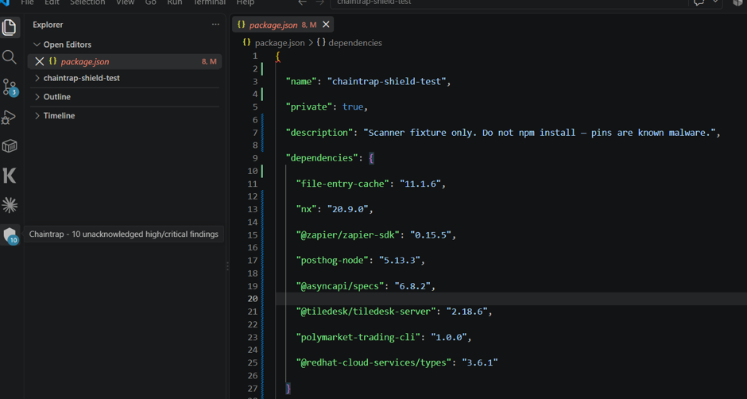
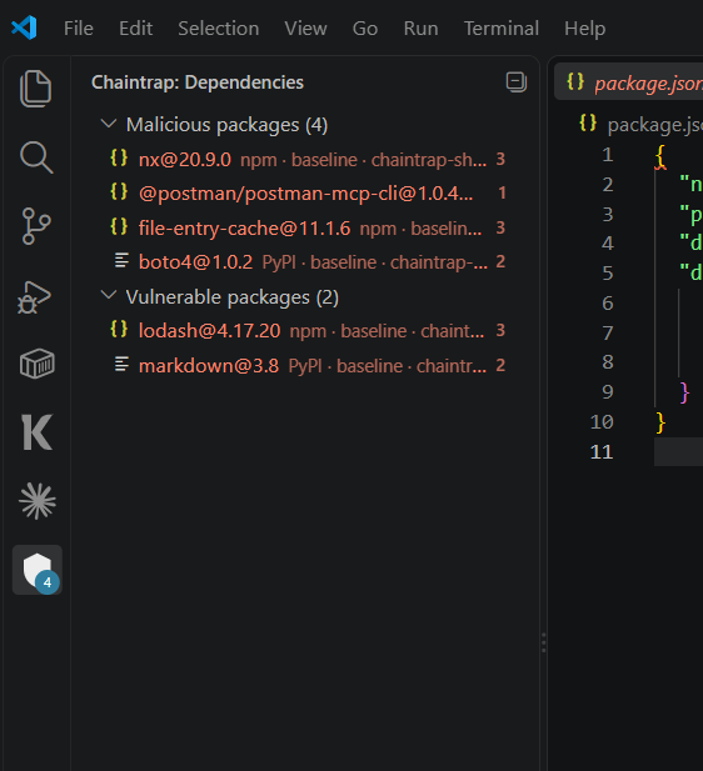

<h1 style="font-family: Palatino, 'Palatino Linotype', 'Book Antiqua', Georgia, serif; font-weight: 700; letter-spacing: -0.03em; margin: 0.4em 0 0.25em;">Chaintrap Agent Shield</h1>

<b>Stop malware dependencies from hiding in your editor.</b> 
When Cursor, Claude Code, or Copilot adds a package, Chaintrap flags it if it is malicious or vulnerable—so you can uninstall it before it stays in the project.

<a href="https://marketplace.visualstudio.com/items?itemName=pri17m.chaintrap-agent-shield"><b>Marketplace</b></a>
&nbsp;·&nbsp;
<a href="https://github.com/pri17m/chaintrap-agent-shield"><b>GitHub</b></a>
&nbsp;·&nbsp;
<a href="PRIVACY.md"><b>Privacy</b></a>

A badge when something dangerous is sitting in the open workspace.

Malicious packages vs vulnerable packages—open the file or uninstall from here.

---

<h2 style="font-family: Palatino, 'Palatino Linotype', 'Book Antiqua', Georgia, serif; font-weight: 700;">Why install this?</h2>

AI coding agents install npm and PyPI packages for you. A malicious version can steal credentials, run extra scripts, or quietly stay in the lockfile after the chat is over.

<b>Chaintrap Agent Shield watches the workspace</b> and tells you when a dependency is malware or known-vulnerable—including packages pulled in through MCP configs, not only <code>package.json</code>.

You see it in the editor. You can open the pin, acknowledge the risk, or uninstall it in one step.

---

<h2 style="font-family: Palatino, 'Palatino Linotype', 'Book Antiqua', Georgia, serif; font-weight: 700;">Features</h2>

<b>Catch malware in the project.</b> Scans your workspace and flags a dependency if it is malicious or vulnerable.

<b>Cover what agents actually add.</b> Project dependencies and packages referenced from MCP server configs.

<b>Act from the tree.</b> Malicious vs vulnerable lists. Click to open the file. Right-click to uninstall malware pins.

<b>Keep watching.</b> Full check when you open a folder. Then new and changed items are reviewed as the agent keeps working.

<b>Make the risk explicit.</b> High and critical findings open a Chaintrap panel so you confirm you understand before you move on.

---

<h2 style="font-family: Palatino, 'Palatino Linotype', 'Book Antiqua', Georgia, serif; font-weight: 700;">Get started</h2>

<ol style="font-family: 'Trebuchet MS', 'Gill Sans', 'Segoe UI', sans-serif; line-height: 1.55;">
<li>Install <b>Chaintrap Agent Shield</b> (<code>pri17m.chaintrap-agent-shield</code>).</li>
<li>Open a folder. Status bar: <code>Chaintrap: scanning workspace…</code></li>
<li>Open the <b>Chaintrap</b> activity bar → <b>Dependencies</b>.</li>
</ol>

No API key required.

---

<h2 style="font-family: Palatino, 'Palatino Linotype', 'Book Antiqua', Georgia, serif; font-weight: 700;">Commands</h2>

<table>
<tr>
<th style="font-family: Palatino, Palatino Linotype, Georgia, serif;">Command</th>
<th style="font-family: Palatino, Palatino Linotype, Georgia, serif;">What it does</th>
</tr>
<tr>
<td style="font-family: 'Trebuchet MS', 'Gill Sans', 'Segoe UI', sans-serif;"><b>Chaintrap: Rescan workspace baseline</b></td>
<td style="font-family: 'Trebuchet MS', 'Gill Sans', 'Segoe UI', sans-serif;">Scan the workspace again</td>
</tr>
<tr>
<td style="font-family: 'Trebuchet MS', 'Gill Sans', 'Segoe UI', sans-serif;"><b>Chaintrap: Review agent changes since last session</b></td>
<td style="font-family: 'Trebuchet MS', 'Gill Sans', 'Segoe UI', sans-serif;">What appeared after this window opened</td>
</tr>
<tr>
<td style="font-family: 'Trebuchet MS', 'Gill Sans', 'Segoe UI', sans-serif;"><b>Chaintrap: Acknowledge high/critical finding</b></td>
<td style="font-family: 'Trebuchet MS', 'Gill Sans', 'Segoe UI', sans-serif;">Confirm you have seen a serious finding</td>
</tr>
<tr>
<td style="font-family: 'Trebuchet MS', 'Gill Sans', 'Segoe UI', sans-serif;"><b>Chaintrap: Uninstall malicious package</b></td>
<td style="font-family: 'Trebuchet MS', 'Gill Sans', 'Segoe UI', sans-serif;">Remove a malware pin from the Dependencies view</td>
</tr>
<tr>
<td style="font-family: 'Trebuchet MS', 'Gill Sans', 'Segoe UI', sans-serif;"><b>Chaintrap: Open finding location</b></td>
<td style="font-family: 'Trebuchet MS', 'Gill Sans', 'Segoe UI', sans-serif;">Jump to the file that pinned it</td>
</tr>
</table>

---

<h2 style="font-family: Palatino, 'Palatino Linotype', 'Book Antiqua', Georgia, serif; font-weight: 700;">Privacy</h2>

Reads dependency and MCP files in the folders you have open. Does not run workspace code and does not upload source. Full detail: <a href="PRIVACY.md"><b>PRIVACY.md</b></a>.

---

MIT. <a href="https://github.com/pri17m/chaintrap-agent-shield">github.com/pri17m/chaintrap-agent-shield</a>

