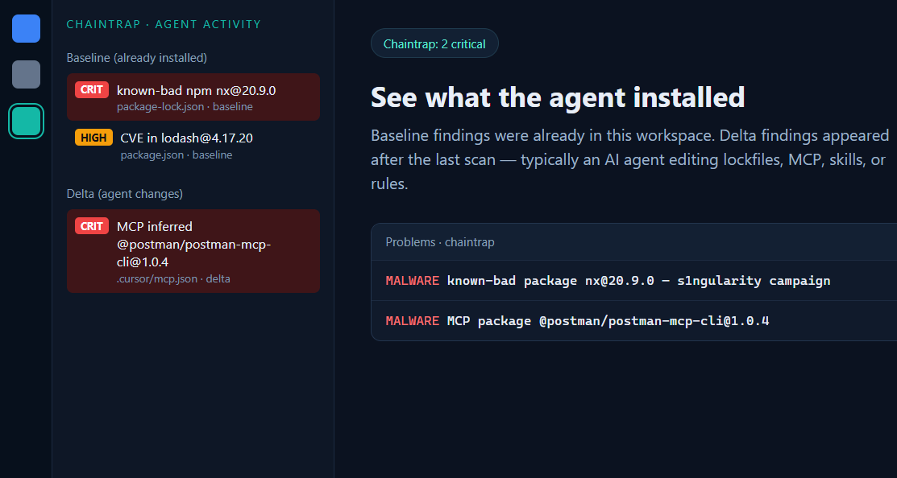
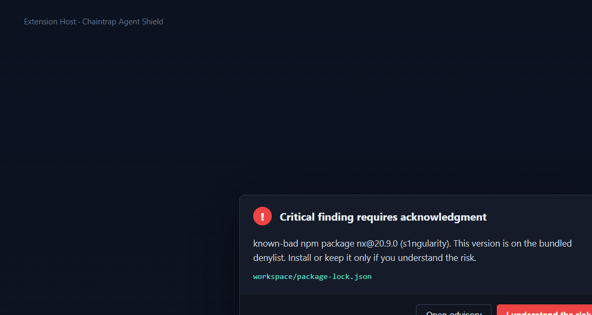
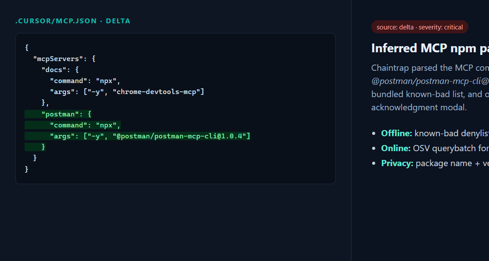

# Chaintrap Agent Shield

> **See what your AI coding agent installed.** Baseline-scan the repos you have open, then warn when new packages, MCP servers, skills, or rules look malicious or vulnerable.

VS Code / Cursor extension for individual developers. **Publisher:** `pri17m`.

## Why this exists

Agentic tools (Cursor, Claude Code, Copilot Chat) can add npm/PyPI packages, MCP servers, and skills without a human noticing. This extension:

1. **Phase A — Baseline.** On workspace open, inventories every open folder plus user `.cursor` / MCP config. Analyzes **all** packages via [OSV](https://osv.dev) and a bundled known-bad list, and heuristics on skills/rules. Flags threats that were already installed.
2. **Phase B — Diff.** Watches the same files. Analyzes **only new/changed** items and warns.
3. **Warn + ack.** Malware (`MAL-*` or known-bad) requires “I understand the risk.” CVEs show in Problems.

No Chaintrap API key is required for package/MCP checks. OSV is public.

## 60-second setup

1. Install from [GitHub Releases](https://github.com/pri17m/chaintrap-agent-shield/releases) (`code --install-extension chaintrap-agent-shield-0.1.0.vsix`), or from the Marketplace (`pri17m.chaintrap-agent-shield`) once `vsce publish` succeeds for publisher `pri17m`.
2. Open a folder. Status bar: `Chaintrap: scanning workspace…` then `baseline complete`.
3. Open the **Chaintrap** activity bar for baseline vs delta findings.

## Screenshots







## What is watched

| Surface | Paths |
|---------|--------|
| Dependencies | `package.json`, `package-lock.json`, `requirements.txt` |
| MCP | workspace `.cursor/mcp.json`, `~/.cursor/mcp.json`, VS Code User `mcp.json` |
| Skills | `.cursor/skills/**/SKILL.md`, `.claude/skills/**/SKILL.md` |
| Rules | `.cursor/rules/**`, `AGENTS.md`, `.cursorrules` |

## Commands

- **Chaintrap: Rescan workspace baseline**
- **Chaintrap: Review agent changes since last session**
- **Chaintrap: Deep-scan installed VS Code extensions (API key)** — optional v1.1
- **Chaintrap: Open Guard install-protection docs** — companion product that can **block** `npm`/`pip` installs

## Privacy

- Package **name + version** (and MCP-inferred packages) are sent to `https://api.osv.dev/v1/querybatch`.
- Skill and rule **file contents stay on your machine**.
- Source code is not uploaded.
- Optional Chaintrap deep extension scans send only the VS Code extension id to `scan.chaintrap.com` when you set `chaintrap.apiKey`.

Permissions: the extension only watches the globs listed above (plus user-level Cursor MCP/skills). It does not request a broad `*` filesystem permission beyond those paths.

Full policy: [PRIVACY.md](PRIVACY.md) · [https://chaintrap.com](https://chaintrap.com)

## Settings

| Setting | Default | Purpose |
|---------|---------|---------|
| `chaintrap.apiBase` | `https://scan.chaintrap.com` | Optional deep-scan API |
| `chaintrap.apiKey` | empty | Optional `X-API-Key` |
| `chaintrap.enableDeepExtensionScan` | `false` | Notify when VS Code extensions change |

## Develop

```bash
cd chaintrap-agent-shield
npm install
npm test
npm run compile
```

Press F5 in VS Code to launch the Extension Development Host, then open `fixtures/dogfood` (known-bad `nx` + MCP package + suspicious skill). See [DOGFOOD.md](DOGFOOD.md).

Sync known-bad intel from a sibling checkout:

```bash
npm run sync-intel
```

Package:

```bash
npm run package
```

Publish (requires Marketplace PAT for publisher `pri17m`):

Create a Classic Azure DevOps PAT with **Marketplace (Acquire, Publish)** for publisher `pri17m` (https://marketplace.visualstudio.com/manage), then:

```bash
npx @vscode/vsce login pri17m
npx @vscode/vsce publish
```

A publish attempt without that PAT fails with TF400813. The packaged VSIX is also attached to GitHub Releases for dogfood.

## License

MIT
